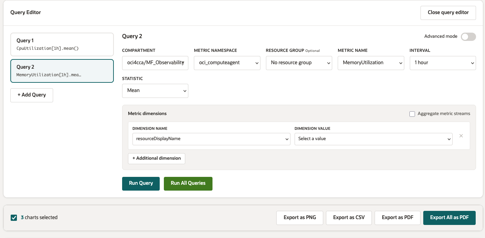
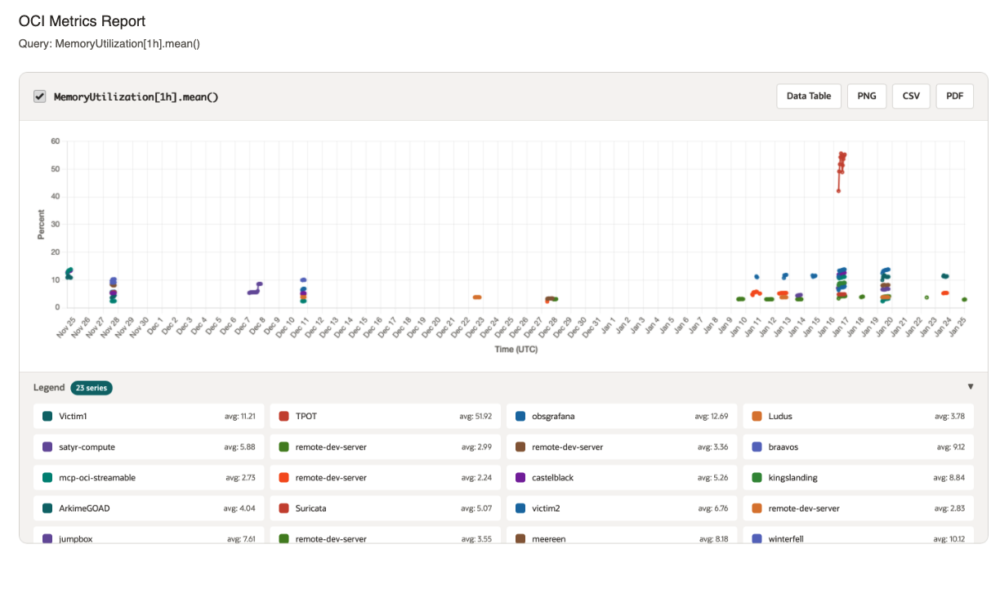
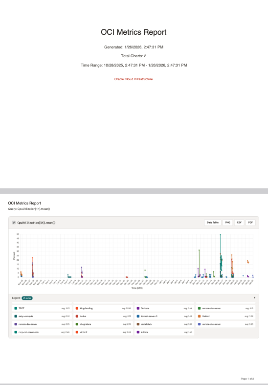

# OCI Metrics Report Generator

A tool for querying and visualizing Oracle Cloud Infrastructure (OCI) Monitoring metrics using the OCI SDK and MQL (Monitoring Query Language).


## Features

- **Web UI** - Interactive dashboard with OCI Redwood design theme
- **CLI Tool** - Generate reports directly from command line (ideal for CloudShell)
- **Multiple Authentication Methods**:
  - OCI Config File (default)
  - Instance Principal (for compute instances)
  - Security Token (for CloudShell)
  - Resource Principal (for OCI Functions)

### Web Interface Features

- **Query Builder UI**: Similar to OCI Console's metric explorer
  - **Searchable Compartment Selector** - Type to filter compartments with hierarchical view
  - Select namespace, metric, interval, and statistic
  - **Dimension Filtering** - Filter metrics by dimension name/value (like OCI Console)
  - Resource group filtering
  - Aggregate metric streams option
  - Advanced mode for raw MQL queries

- **Multiple Queries**: Add and manage multiple queries simultaneously

- **Interactive Charts**:
  - Time-series visualization with Chart.js
  - **Gap Detection** - Missing data shown as gaps, not connected lines
  - **Collapsible Legend** - Click to show/hide individual series
  - **Smart Labels** - Extracts readable names from dimension OCIDs
  - Data table toggle with sortable columns
  - Zoom and pan support

- **Export Options**:
  - Export individual charts as PNG
  - Export individual charts as PDF
  - Export data as CSV
  - Export selected charts as multi-page PDF
  - Export all charts as full PDF report with title page

- **Modern UI**:
  - OCI Redwood design theme with official color palette
  - Responsive layout for desktop and tablet
  - Toast notifications for feedback
  - Keyboard navigation support

### CLI Features

- Generate standalone HTML reports
- JSON output option
- Discovery commands (list namespaces, metrics, compartments)
- CloudShell optimized wrapper script

## Screenshots

### Query Builder with Dimension Filtering
The query builder allows you to filter metrics by dimensions, similar to the OCI Console:
- Select dimension name from available dimensions
- Choose dimension value from discovered values
- Add multiple dimension filters
- Toggle "Aggregate metric streams" to combine or separate data



### Chart Visualization with Gap Detection
Charts display time-series data with intelligent gap detection:
- Gaps in data shown as breaks in lines (not connected)
- Small dots indicate actual data points
- Collapsible legend with series averages
- Export options: Data Table, PNG, CSV, PDF



### PDF Export with Title Page
Export all charts as a professional PDF report:
- Title page with report metadata
- Time range and chart count
- Each chart on a separate page
- Page numbers for easy navigation



### Searchable Compartment Selector
Type to instantly filter compartments:
- Shows compartment count while filtering
- Hierarchical indentation shows parent/child relationships
- Full path displayed with matching text highlighted
- Keyboard navigation (↑↓ Enter Escape)

## Prerequisites

1. **Python 3.8+** installed

2. **OCI CLI installed and configured**
   - Install OCI CLI: https://docs.oracle.com/en-us/iaas/Content/API/SDKDocs/cliinstall.htm
   - Configure with: `oci setup config`
   - This creates `~/.oci/config` with your API key credentials
   - Verify setup: `oci iam region list`

3. **OCI User with Monitoring permissions**
   - Your OCI user must have permissions to read metrics and compartments
   - See [Required IAM Policies](#required-iam-policies) section below

4. One of the following **authentication methods**:
   - OCI CLI configured (`~/.oci/config`) - most common for local development
   - Instance principal enabled (on OCI compute instances)
   - CloudShell environment (automatic authentication)

## Installation

1. Clone or download this repository:
   ```bash
   cd /path/to/metricreport
   ```

2. Create a virtual environment (recommended):
   ```bash
   python -m venv venv
   source venv/bin/activate  # On macOS/Linux
   # or
   venv\Scripts\activate  # On Windows
   ```

3. Install dependencies:
   ```bash
   pip install -r requirements.txt
   ```

4. (Optional) Use the run script which handles venv setup:
   ```bash
   ./run.sh
   ```

## Authentication

The application supports multiple authentication methods, auto-detected based on environment.

### 1. OCI Config File (Default)

Uses `~/.oci/config` file with API key authentication.

```bash
# Default config file and profile
python app.py

# Custom config file and profile
export OCI_CONFIG_FILE="/path/to/config"
export OCI_CONFIG_PROFILE="CUSTOM_PROFILE"
python app.py
```

### 2. Instance Principal (OCI Compute / CloudShell)

For running on OCI compute instances or in CloudShell with instance principal.

```bash
export OCI_CLI_AUTH=instance_principal
python app.py

# Or explicitly set auth type
export OCI_AUTH_TYPE=instance_principal
python app.py
```

### 3. Security Token (CloudShell Delegation)

Automatically detected in OCI CloudShell environment.

```bash
# CloudShell sets OCI_CLI_CLOUD_SHELL automatically
python app.py
```

### 4. Resource Principal (OCI Functions)

For running inside OCI Functions.

```bash
# Automatically detected when OCI_RESOURCE_PRINCIPAL_VERSION is set
python app.py
```

### Environment Variables

| Variable | Description |
|----------|-------------|
| `OCI_CONFIG_FILE` | Path to OCI config file (default: `~/.oci/config`) |
| `OCI_CONFIG_PROFILE` | OCI config profile name (default: `DEFAULT`) |
| `OCI_AUTH_TYPE` | Force auth type: `config_file`, `instance_principal`, `resource_principal`, `security_token` |
| `OCI_REGION` | Override OCI region |
| `OCI_TENANCY` | Tenancy OCID (for instance/resource principal) |
| `OCI_CLI_AUTH` | OCI CLI auth setting (detected automatically) |

### Required IAM Policies

Your OCI user must have permissions to access the Monitoring service. Ask your tenancy administrator to create the following policies:

```hcl
# ===========================================
# For user/group authentication (API Key)
# ===========================================

# Full tenancy access (recommended for admins)
Allow group <your-group> to read metrics in tenancy
Allow group <your-group> to read compartments in tenancy

# OR: Specific compartment only (more restrictive)
Allow group <your-group> to read metrics in compartment <compartment-name>
Allow group <your-group> to read compartments in compartment <compartment-name>

# ===========================================
# For instance principal (OCI Compute)
# ===========================================

# First, create a dynamic group matching your instances:
# Example: ALL {instance.compartment.id = 'ocid1.compartment.oc1..xxx'}

Allow dynamic-group <your-dynamic-group> to read metrics in tenancy
Allow dynamic-group <your-dynamic-group> to read compartments in tenancy

# ===========================================
# For CloudShell (automatic via user policies)
# ===========================================
# CloudShell uses your user's permissions, so the user/group policies above apply
```

**Minimum required permissions:**
- `read metrics` - Query metric data from the Monitoring service
- `read compartments` - List compartments for the dropdown selector

**Verify your permissions:**
```bash
# Test if you can list metrics (requires read metrics permission)
oci monitoring metric list --compartment-id <your-compartment-ocid> --namespace oci_computeagent

# Test if you can list compartments (requires read compartments permission)
oci iam compartment list --compartment-id-in-subtree true
```

## Usage - Web Interface

1. Start the application:
   ```bash
   python app.py
   # or use the run script
   ./run.sh
   ```

2. Open your browser and navigate to:
   ```
   http://localhost:8080
   ```

3. **Select a Compartment**:
   - Click on the compartment field or start typing
   - Type to filter compartments (e.g., "prod" to find production compartments)
   - Use ↑↓ arrow keys to navigate, Enter to select
   - Compartments show hierarchical structure with full path

4. **Create a Query**:
   - Choose a metric namespace (e.g., `oci_computeagent`)
   - Select a metric name (e.g., `CpuUtilization`)
   - Configure interval and statistic
   - (Optional) Add dimension filters to narrow results
   - Click "Run Query"

5. **Filter by Dimensions**:
   - After selecting a metric, dimension options appear
   - Click "+ Additional dimension" to add a filter
   - Select dimension name (e.g., `resourceId`, `availabilityDomain`)
   - Select dimension value from discovered values
   - Check "Aggregate metric streams" to combine all streams into one

6. **Use Advanced Mode**:
   - Toggle "Advanced mode" switch
   - Enter raw MQL query, e.g.:
     ```
     CpuUtilization[1h].groupBy(resourceId).mean()
     ```

7. **Add Multiple Queries**:
   - Click "Add Query" to create additional queries
   - Run individual queries or "Run All Queries"
   - Toggle visibility per query

8. **Interact with Charts**:
   - Click legend items to show/hide individual series
   - **Gap visualization** - Gaps in data are shown as breaks in the line (not connected)
   - Small dots indicate actual data points
   - Click "Data Table" to view raw data
   - Export individual charts as PNG, CSV, or PDF

9. **Export Reports**:
   - Select charts using checkboxes for batch export
   - **Export as PNG** - High-resolution image of chart
   - **Export as CSV** - Raw data for spreadsheet analysis
   - **Export as PDF** - Single chart with header and metadata
   - **Export Selected as PDF** - Multi-page PDF with selected charts
   - **Export All as PDF** - Complete report with title page

## MQL Examples

### Basic CPU Utilization
```
CpuUtilization[1h].mean()
```

### CPU by Resource ID
```
CpuUtilization[1h].groupBy(resourceId).max()
```

### Memory Utilization with Dimension Filter
```
MemoryUtilization[5m]{availabilityDomain = "AD-1"}.mean()
```

### Multiple Dimension Filters
```
CpuUtilization[1h]{resourceId = "ocid1.instance...", faultDomain = "FAULT-DOMAIN-1"}.mean()
```

### Network Bytes with Percentile
```
NetworkBytesIn[1h].percentile(0.95)
```

### Block Volume IOPS
```
VolumeReadOps[5m].sum()
```

## Common Metric Namespaces

| Namespace | Description |
|-----------|-------------|
| `oci_computeagent` | Compute instance metrics |
| `oci_blockvolume` | Block volume metrics |
| `oci_vcn` | Virtual cloud network metrics |
| `oci_lbaas` | Load balancer metrics |
| `oci_autonomous_database` | Autonomous database metrics |
| `oci_database` | Database service metrics |
| `oci_objectstorage` | Object storage metrics |
| `oci_filestorage` | File storage metrics |

## Usage - CLI (CloudShell & Command Line)

The CLI tool generates standalone HTML reports without running a web server.

### Quick Start (CloudShell)

```bash
# Upload files to CloudShell or clone from git
# Then run:
./cloudshell_report.sh <compartment_ocid> <namespace> <metric1> [metric2] ...

# Example: Compute metrics
./cloudshell_report.sh ocid1.compartment.oc1..xxx oci_computeagent CpuUtilization MemoryUtilization
```

### CLI Examples

```bash
# List available namespaces
python generate_report.py -c <compartment_ocid> --list-namespaces

# List metrics in a namespace
python generate_report.py -c <compartment_ocid> -n oci_computeagent --list-metrics

# Generate report with multiple metrics (24 hours)
python generate_report.py -c <compartment_ocid> -n oci_computeagent \
    -m CpuUtilization -m MemoryUtilization -o report.html

# 7-day report grouped by resource
python generate_report.py -c <compartment_ocid> -n oci_computeagent \
    -m CpuUtilization --hours 168 --group-by resourceId -o cpu_report.html

# Use raw MQL query
python generate_report.py -c <compartment_ocid> -n oci_computeagent \
    --mql "CpuUtilization[1h].groupBy(availabilityDomain).max()" -o cpu_by_ad.html

# Output as JSON instead of HTML
python generate_report.py -c <compartment_ocid> -n oci_computeagent \
    -m CpuUtilization --json -o metrics.json

# CloudShell with instance principal
python generate_report.py --auth instance_principal -c <compartment_ocid> \
    -n oci_computeagent -m CpuUtilization
```

### CLI Options

| Option | Description |
|--------|-------------|
| `-c, --compartment` | Compartment OCID (required) |
| `-n, --namespace` | Metric namespace |
| `-m, --metric` | Metric name (can specify multiple) |
| `--mql` | Raw MQL query (can specify multiple) |
| `-i, --interval` | Aggregation interval: `1m`, `5m`, `15m`, `1h`, `6h`, `1d` |
| `-s, --statistic` | Statistic: `mean`, `max`, `min`, `sum`, `count`, `p50`, `p90`, `p95`, `p99` |
| `-g, --group-by` | Dimension to group by (e.g., `resourceId`) |
| `--hours` | Hours of data to fetch (default: 24) |
| `-o, --output` | Output file path |
| `--json` | Output JSON instead of HTML |
| `--auth` | Authentication method |
| `--list-namespaces` | List available namespaces and exit |
| `--list-metrics` | List available metrics and exit |

## API Endpoints

The Flask backend provides the following REST endpoints:

| Endpoint | Method | Description |
|----------|--------|-------------|
| `/api/auth-info` | GET | Get current authentication info |
| `/api/compartments` | GET | List all accessible compartments |
| `/api/namespaces` | GET | List metric namespaces in a compartment |
| `/api/resource-groups` | GET | List resource groups in a namespace |
| `/api/metrics` | GET | List metrics in a namespace |
| `/api/dimensions` | GET | List all dimensions and values for a metric |
| `/api/dimension-values` | GET | List values for a specific dimension |
| `/api/query` | POST | Execute a single metric query |
| `/api/query-multiple` | POST | Execute multiple queries |
| `/api/query-options` | GET | Get available statistics and intervals |
| `/api/common-namespaces` | GET | Get common namespaces with descriptions |

### Dimension API Examples

```bash
# Get all dimensions for a metric
curl "http://localhost:8080/api/dimensions?compartment_id=<ocid>&namespace=oci_computeagent&metric_name=CpuUtilization"

# Get values for a specific dimension
curl "http://localhost:8080/api/dimension-values?compartment_id=<ocid>&namespace=oci_computeagent&dimension_name=resourceId"
```

## Server Environment Variables

| Variable | Default | Description |
|----------|---------|-------------|
| `PORT` | `8080` | Server port |
| `FLASK_DEBUG` | `false` | Enable debug mode |

## Project Structure

```
metricreport/
├── app.py                  # Flask backend with OCI SDK integration
├── generate_report.py      # CLI tool for report generation
├── requirements.txt        # Python dependencies
├── run.sh                  # Startup script with venv setup
├── cloudshell_report.sh    # CloudShell wrapper script
├── static/
│   └── index.html          # Single-page web application
└── README.md               # This file
```

## Troubleshooting

### "Failed to load compartments"
- Verify your OCI config file exists and is valid
- Check that you have `read compartments` permission
- Ensure your API key is properly configured

### "No metrics found"
- Ensure resources exist in the selected compartment
- Verify you have `read metrics` permission
- Some namespaces require resources to be actively emitting metrics

### "No dimensions available"
- Select a metric first - dimensions are loaded per metric
- The metric may not have any dimensions defined
- Check if resources are actively emitting metrics

### Chart not displaying data
- Check the time range - data may not exist for the selected period
- Verify the MQL query syntax is correct
- Check browser console for JavaScript errors

### Chart shows gaps in the line
- This is expected behavior - gaps indicate periods where no data was collected
- Common reasons: resource was stopped, metric agent not running, network issues
- The gap detection uses 2.5x the median data interval as the threshold
- Small dots on the chart indicate actual data points

### Compartment search not working
- Wait for compartments to fully load (check the loading indicator)
- Try clearing the input and typing again
- Ensure you have permissions to list compartments

## Keyboard Shortcuts

| Shortcut | Action |
|----------|--------|
| `↓` / `↑` | Navigate dropdown options |
| `Enter` | Select highlighted option |
| `Escape` | Close dropdown |
| `Tab` | Move to next field |

## Browser Support

- Chrome 80+
- Firefox 75+
- Safari 13+
- Edge 80+

## License

This project is provided as-is for educational and internal use.

## Contributing

Contributions are welcome! Please feel free to submit issues or pull requests.

## Changelog

### v1.3.0
- Added gap detection in charts - missing data shown as gaps instead of connected lines
- Automatic interval detection to identify data gaps
- Small data points displayed to indicate actual measurements
- Improved tooltip handling for gap regions

### v1.2.0
- Added PDF export functionality using jsPDF
- Export individual charts as PDF
- Export selected charts as multi-page PDF
- Export all charts as complete PDF report with title page
- PDF includes headers, query details, and timestamps

### v1.1.0
- Added OCI Redwood design theme
- Added searchable compartment combobox with type-to-filter
- Added dimension filtering (name/value selection)
- Added "Aggregate metric streams" option
- Enhanced chart legend with collapsible view
- Smart label extraction from OCIDs
- Added dimension-related API endpoints
- Improved keyboard navigation
- Added result count display when filtering

### v1.0.0
- Initial release
- Basic query builder with MQL support
- Multiple authentication methods
- Chart visualization with export
- CLI tool for CloudShell
